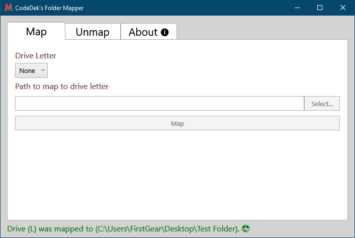
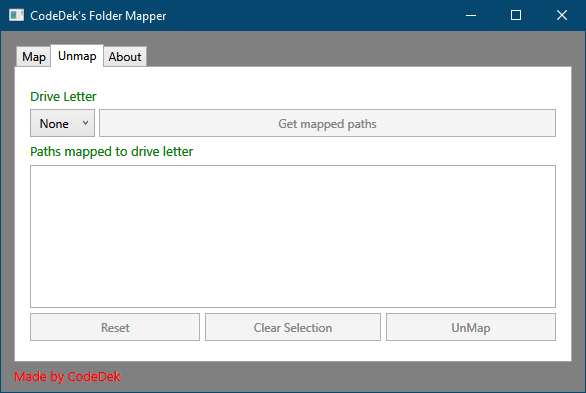
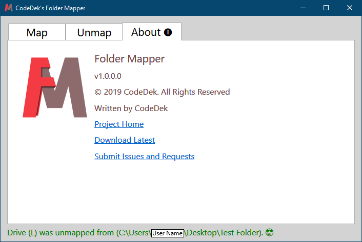

# CodeDek's Folder Mapper
This is a Windows App used for mapping or unmapping any folder to and from a drive.
It's still in development but should soon reach final. Keep an eye on releases.

### License & Copyright
© 2019 CodeDek. All Rights Reserved.
Licensed under the [GPL-3.0](LICENSE).

### Dependencies
- [.NET Framework 4.8](https://dotnet.microsoft.com/download/dotnet-framework/net48) (Required to be installed on your machine)

### Map Folder to a drive letter
1. Select a drive letter
2. Press the Select button to select a folder
3. Click Map

**Figure 1** Map Folder

### Unmap Folder from drive letter
1. Select the drive letter to unmap
2. Click Get mapped paths (all paths mapped to the drive letter will be listed)
3. Select the path to unmap from the list
4. Click unmap

- The Clear Selection Button clears the selected item from the list.
- The Reset Button resets everything on the tab to its defaults.

**Figure 2** Unmap Folder

### About
This displays information about the app, its website, source and updates.

**Figure 3** About Folder Mapper

### Submit Issues or Requests
If you have any issues or requests, you can submit your [issues here](https://github.com/codedek/CodeDek.FolderMapper/issues).

### Downloads
[Version 1.0](https://github.com/codedek/CodeDek.FolderMapper/releases/tag/v1.0) - [Change log](CHANGELOG.md)
