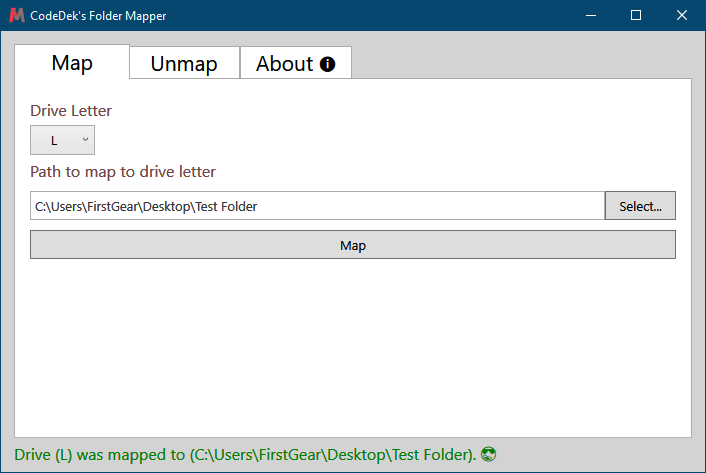
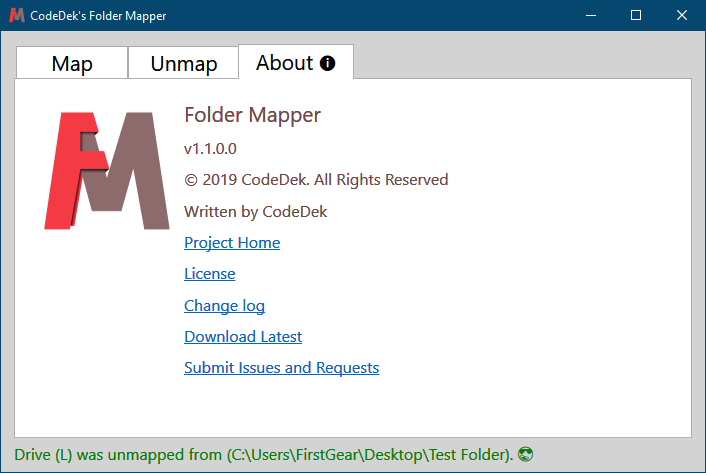

# CodeDek's Folder Mapper

Map or unmap any windows folder to a drive letter.
Scroll down to the [downloads](#downloads) section to get a specific version and to view its [change log](#downloads), or just go to [releases](https://github.com/codedek/CodeDek.FolderMapper/releases) to get the latest.

### License & Copyright
© 2019 CodeDek. All Rights Reserved.
Licensed under the [GPL-3.0](LICENSE).

### Submit Issues or Requests
If you have any issues or requests, you can submit your [issues here](https://github.com/codedek/CodeDek.FolderMapper/issues).

### Dependencies
- [.NET Framework 4.6.1](https://dotnet.microsoft.com/download/dotnet-framework/net48) (Required to be installed on your machine)

## How to use Features

### Map Folder to a drive letter
1. Select a drive letter
2. Press the Select button to select a folder
3. Click Map

### Unmap Folder from drive letter
1. Select the drive letter to unmap
2. Click Get mapped paths (all paths mapped to the drive letter will be listed)
3. Select the path to unmap from the list
4. Click unmap

- The Clear Selection Button clears the selected item from the list.
- The Reset Button resets everything on the tab to its defaults.

### About
- This displays information about the app, its website, source and updates.

### Downloads
[Version 1.0](https://github.com/codedek/CodeDek.FolderMapper/releases/tag/v1.0) - [Change log](CHANGELOG.md)

[Version 1.1.0](https://github.com/codedek/CodeDek.FolderMapper/releases/tag/v1.1.0) - [Change log](CHANGELOG.md)
